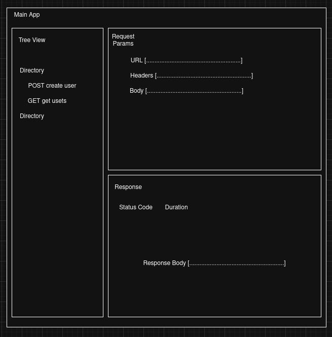

# Overview
I'm still progressing through the application. I find myself getting lost in a bit of state management already
and have decided that dev notes are the only way to move forward to avoid serious issues in the future. 

Weirdly enough, this has made me feel like a better react dev.

# Up Nexb
We can create directories, and now it's time to move on to the heart of the application: requests.

This will be a bit complicated, but the goal is to have a modal open that allows users to enter new request info
(URL, headers, method, etc.). This should simplify state management a bit, because we can keep it 
in the modal. If we tried to jam all of these options into the TreeView component, it would be a nightmare.

So, in the modal I'll add a few things:
- Text input for request names
    - They'll sit in directories, and will eventually be displayed like: METHOD inputted_name
    - Since we store everything in JSON, we don't need to account for any special naming restrictions. You can really put whatever you want.
    BUT I do think there should be a limit on total length of name, we dont want them to get cut off in the view. 
- A method dropdown that is selectable 
    - This will be nice because we can remove any chance for typos.
- URL
    - Need to know where to send the request
    
Everything else will serve as sugar on top. Eventually, we'll get to a point where headers, etc. are set in the modal. But to start, keeping it 
simple will be the ideal path forward. 

It will eventually look something like this:

